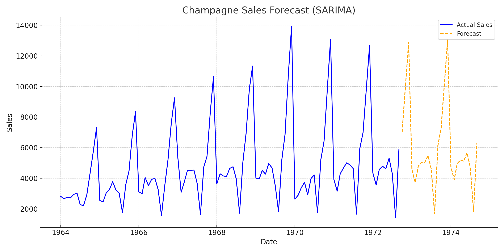

# Champagne Sales Forecast

This project demonstrates time series forecasting using the SARIMA model on monthly champagne sales data.

## Project Highlights
- Cleaned time series data from 1964 to 1972
- Handled missing values using interpolation
- Fitted SARIMA model with seasonal order
- Forecasted next 24 months of champagne sales
- Visualized actual vs forecasted sales

## Requirements
- Python
- pandas
- matplotlib
- statsmodels

## Output

## Author
Siddhardha Gorja
